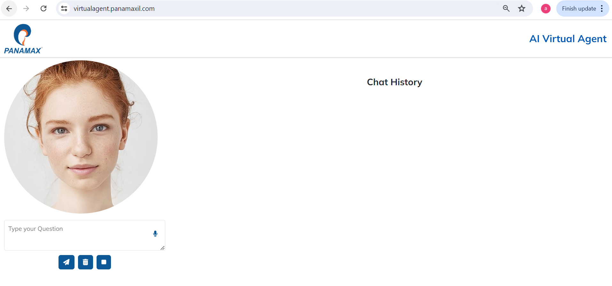
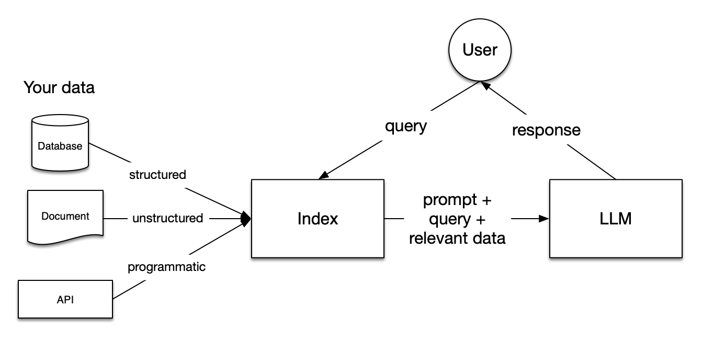

# Talking avatar (backend poc)

Introducing Our Revolutionary Talking Avatar: Powered by RAG, LlamaIndex, Redis DB, and OpenAI LLM

At the heart of our Talking Avatar is RAG (Retrieval-Augmented Generation), an advanced natural language processing model that combines the power of retrieval-based and generative AI techniques. RAG allows our avatar to retrieve relevant information from vast knowledge bases and generate contextually relevant responses in real-time, enabling fluid and engaging conversations with users.


## What is Retrieval-Augmented Generation (RAG)?
Retrieval-Augmented Generation (RAG) is a hybrid approach that enhances the performance of language models by combining text generation with document retrieval. It works in two main steps:

Retrieval: When a query is given, relevant information is retrieved from a knowledge base (like a set of documents, a database, or a vector store). This retrieval can be done using methods like semantic search, where embeddings of documents are stored, and the query is matched to the most relevant pieces of information.

Generation: After retrieving relevant documents, the language model (such as GPT) uses the retrieved context to generate a response. By grounding the generation in actual data, RAG produces more accurate, reliable, and contextually appropriate answers.

Why use RAG?
Improved Accuracy: The language model is able to use real-world data, leading to more precise answers.
Scalability: RAG can efficiently scale to work with large knowledge bases without needing the language model to memorize vast amounts of information.
Dynamic Knowledge: Since the system retrieves updated information on-the-fly, it can respond with the latest knowledge without retraining the model.



## Installation


### Environment Variables

To run this project, you will need to add the following environment variables to your .env file

`OPENAI_API_KEY`


### Install requirements

Install with pip

```bash
  pip install -r requirements.txt
```

## Start server   
This will start flask server on port 5000
```bash
  cd flask_app
  python hello.py
```

## Postman

Set auth key


Get response from RAG


Response from GPT model


## Demo URL
https://virtualagent.panamaxil.com/
